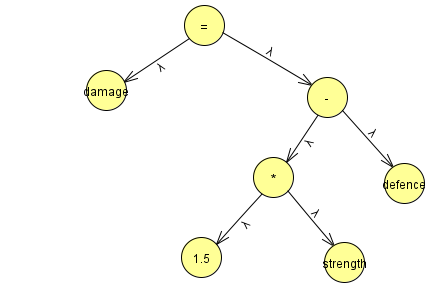
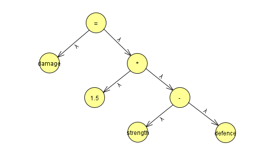

# C++ 进阶知识

## 从源代码到可执行文件

### 一个 C++ 程序究竟是怎么跑起来的

在我们刚开始学习 C++ 的时候，我们运行程序的方法往往是使用 IDE，如 Visual Studio、CLion 等。IDE 会帮助我们完成编译、链接等步骤，最终生成可执行文件。我们只需要点击运行按钮，即可在 IDE 中看到程序的输出。

在本节课程中，我们将学习如何手动编译 C++ 程序，了解编译、链接等步骤的具体内容。

### 过程总览


### 编译工具

针对不同的应用场景和平台，各大厂家设计了不同的C++编译工具

- MSVC（Microsoft Visual C++）：这是微软开发的一款 C++ 开发工具， Visual Studio 中就内置了 MSVC

- GCC（GNU Compiler Collection）：GCC 是由 GNU 开发的一套编译工具，支持多种语言。在本节课程中我们使用的编译工具就是 GCC（针对 C 的前端程序为 gcc，针对 C++ 的前端程序为 g++）

在本节课程中，我们使用 wsl 作为运行环境，当然，Windows 的环境也是可以的，你可以通过以下的代码完成 gcc 以及相关工具的安装

Linux：
~~~bash
sudo apt update
sudo apt install build-essential cmake ninja-build
~~~

Windows:
~~~bash
//请以管理员身份运行 powershell
Set-ExecutionPolicy RemoteSigned -scope CurrentUser
irm get.scoop.sh | iex

scoop bucket add main
scoop bucket add extras

scoop install gcc
scoop install cmake
~~~

当然，在 Windows 环境中你也可以直接到 [mingw](https://www.mingw-w64.org/downloads/) 和[CMake](https://cmake.org/download/)的官网进行下载，并将 bin 目录添加到环境变量中。

### 预处理(Preprocessing)

```bash
g++ -E attack.cpp -o attack.i
```
作用：

- 处理 #include, #define, #ifdef 等预处理命令。
- 替换宏，展开头文件。

输出：.i 文件（纯C++代码，无预处理指令）

示例：../example/case1

### 编译(Compiling)

~~~bash
g++ -S attack.i -o attack.s
~~~

这一步是编译原理课的重要内容，在这里只进行一些简单的介绍。，

编译的五大步骤：

- 词法分析
- 语法分析
- 语义分析与中间代码生成
- 优化
- 目标代码生成

#### 词法分析

在这一步中，词法分析器（Lexer）读取源代码，将其分解为一系列的标记（token）或词法分析单元（lexeme）。这些是编程语言中的基本元素，如关键字，标识符，字面量等。

~~~
int a = 3 + 5; -> [int] [a] [=] [3] [+] [5] [;]
~~~

#### 语法分析

语法分析器使用由词法分析器生成的各个词法单元来创建树形的中间表示。该中间表示给出了词法分析产生的词法单元流的语法结构。一个比较常见的表示方法是语法树(syntax tree)，树中的每一个内部节点表示一个运算，而子节点表示该运算的分量。

对于下面的代码：

~~~C++
damage=1.5*strength-defence
~~~

一颗比较符合直觉的语法分析树长成这样：



但是也有可能长成这样：



这就是在编译中遇到的二义性问题。

对于另外一组代码：

~~~C++
if(a>1)
    if(a==2)
        std::cout<<"something1";
    else
        std::cout<<"something2";
~~~

同样地，编译器也并不知道 else 应该和哪个 if 配对。

为了解决二义性的问题，我们引入上下文无关文法这个概念，并通过合理地设计这个文法，消除由算符优先级和 if-else 悬挂所引起的文法二义性。

##### 上下文无关文法：

一个上下文无关文法是一个四元组，$ G= \{V,\sum,R,S\} $，其中 $V$ 是非终止符的集合， $\sum$ 是终止符的集合，$R$ 是产生式规则的集合，$S$ 是开始符号。

一个简单的例子：
$V=\{E\}$
$\sum=\{a,b\}$
$S \to E, E \to aEb | \epsilon$

消除由运算符优先级引起的文法二义性
~~~
<expr>   ::= <expr> "+" <term>
          | <expr> "-" <term>
          | <term>

<term>   ::= <term> "*" <factor>
          | <term> "/" <factor>
          | <factor>

<factor> ::= "(" <expr> ")"
          | number
          | identifier
~~~

消除由 if-else 悬挂引起的文法二义性

~~~
<stmt>           ::= <matched_stmt> | <unmatched_stmt>

<matched_stmt>   ::= "if" "(" <expr> ")" <matched_stmt> "else" <matched_stmt>
                  | <other_stmt>

<unmatched_stmt> ::= "if" "(" <expr> ")" <stmt>
                  | "if" "(" <expr> ")" <matched_stmt> "else" <unmatched_stmt>
~~~


### 汇编

~~~bash
g++ -c attack.s -o attack.o
~~~

汇编这一步将编译器生成的中间代码（汇编代码）翻译为机器码（一种包含机器指令的二进制格式文件），但尚未完成链接。

.o 生成的文件不是人类可读的，但是如果你实在是好奇里面究竟有什么，可以在终端输入如下的指令：

~~~bash
objdump -d attack.o
~~~

它会把机器码进行反汇编，输出的格式应该类似于：


~~~
test.o:     file format pe-x86-64


Disassembly of section .text:

0000000000000000 <main>:
   0:   55                      push   %rbp
   1:   48 89 e5                mov    %rsp,%rbp
   4:   48 83 ec 30             sub    $0x30,%rsp
   8:   e8 00 00 00 00          call   d <main+0xd>
   d:   c7 45 fc 01 00 00 00    movl   $0x1,-0x4(%rbp)
  14:   83 7d fc 01             cmpl   $0x1,-0x4(%rbp)
  18:   75 16                   jne    30 <main+0x30>
  1a:   48 8d 15 00 00 00 00    lea    0x0(%rip),%rdx        # 21 <main+0x21>
  21:   48 8b 05 00 00 00 00    mov    0x0(%rip),%rax        # 28 <main+0x28>
  28:   48 89 c1                mov    %rax,%rcx
  2b:   e8 00 00 00 00          call   30 <main+0x30>
  30:   83 7d fc 02             cmpl   $0x2,-0x4(%rbp)
  34:   75 18                   jne    4e <main+0x4e>
  36:   48 8d 15 0b 00 00 00    lea    0xb(%rip),%rdx        # 48 <main+0x48>
  3d:   48 8b 05 00 00 00 00    mov    0x0(%rip),%rax        # 44 <main+0x44>
  44:   48 89 c1                mov    %rax,%rcx
  47:   e8 00 00 00 00          call   4c <main+0x4c>
  4c:   eb 16                   jmp    64 <main+0x64>
  4e:   48 8d 15 16 00 00 00    lea    0x16(%rip),%rdx        # 6b <main+0x6b>
  55:   48 8b 05 00 00 00 00    mov    0x0(%rip),%rax        # 5c <main+0x5c>
  5c:   48 89 c1                mov    %rax,%rcx
  5f:   e8 00 00 00 00          call   64 <main+0x64>
  64:   b8 00 00 00 00          mov    $0x0,%eax
  69:   48 83 c4 30             add    $0x30,%rsp
  6d:   5d                      pop    %rbp
  6e:   c3                      ret
  6f:   90                      nop
~~~


### 链接

~~~bash
g++ main.o foo.o -o program
~~~

链接将多个目标文件和库组织成一个完整的可执行文件或共享库。

示例：../example/case2

#### 静态链接

~~~bash
g++ main.o foo.o -o program
~~~

所有的代码在链接阶段合并成一个单独的大文件，运行的时候无需依赖外部文件库。

- 优点：部署简单，运行稳定
- 缺点：文件体积大，重复冗余，不利于更新

#### 动态链接

~~~bash
g++ main.o -o program -lfoo
~~~

最终生成的可执行文件中包含对动态库的引用，例如 windows 中的 .dll 和 Linux 中的 .so

- 优点：节省空间，多个程序可以共享库，易于更新

- 缺点：运行的时候需要依赖外部库，存在 [依赖地狱](https://zh.wikipedia.org/wiki/%E7%9B%B8%E4%BE%9D%E6%80%A7%E5%9C%B0%E7%8B%B1)


#### 静态库
代码被复制到最终的可执行文件中

~~~bash
g++ -c math.cpp        # 编译成目标文件 math.o
ar rcs libmath.a math.o  # 打包成静态库
g++ main.cpp -L. -lmath -o main  # 链接静态库
~~~
rcs：这是一组参数，r代表 将 math.o 加入库中，c代表创建库文件，s代表生成符号索引。
-L. 表示在当前目录下寻找库文件
-lxxx 表示链接 libxxx.a


#### 动态库
可执行文件运行时加载库文件

~~~bash
g++ -fPIC -shared math.cpp -o libmath.dll  # 创建动态库
g++ main.cpp -L. -lmath -o main           # 链接动态库（运行时需要 libmath.so）
~~~

-fPIC 在 Linux 系统中用于生成可以在任意内存地址加载(位置无关代码)的共享库，对于 Windows系统不是必须的。

#### ../example/case2 示例

我们机器人的行为通过 behavior.h 头文件中的函数进行控制，通过动态链接，我们可以更新头文件，但是无需重新编译其它机器人的源代码。

~~~bash
# 编译动态库（Windows 下生成 .dll，Linux 下生成 .so）
g++ -fPIC -shared src/behavior.cpp -o libbehavior.so   # Linux
# 编译主程序并链接动态库
g++ src/run.cpp -o run.exe -Iinclude -L. -lbehavior
~~~


### 管理大型项目的构建：Makefile 与 Cmake

## 大型项目的构建
使用 g++ 构建项目时，在链接阶段 对源文件或目标文件的顺序有时有要求。例如，如果 firstFile.cpp 中定义了函数 foo，而 secondFile.cpp 中调用了该函数，那么链接命令中 firstFile.o 应出现在 secondFile.o 之后：
~~~bash
g++ secondFile.o firstFile.o -o program
~~~

这是因为早期的链接器按照文件顺序解析符号，若在调用点之前未找到符号定义，就会报错。

此外，在构建大型项目时，由于源文件之间存在复杂的依赖关系（例如头文件修改会影响多个 .cpp 文件），手动判断哪些文件需要重新编译几乎不可能。使用 g++ 时通常只能粗暴地全量重新编译：

~~~bash
// 下面的执行在../example/case3 下执行
//创建一堆没有用的头文件，模拟大项目的高耗时
./dummyCreator.sh
//Win
Measure-Command { g++ src/*.cpp -Iinclude -o run.exe }
//Linux
time g++ src/*.cpp -Iinclude -o run.exe
~~~

这种方式虽简单，但随着项目体积增大，将极大影响构建效率。

### Makefile

因此，借助自动化构建工具如 Make 或 CMake，可以根据文件的修改时间自动判断依赖关系，只编译必要的文件，大幅缩短构建时间，提升开发效率。

因此，借助自动化构建工具如 Make 或 CMake，可以根据文件的修改时间自动判断依赖关系，只编译必要的文件，大幅缩短构建时间，提升开发效率。

Makefile：经典的自动化构建系统
Make 是 Unix 系统中最常用的构建工具之一。通过编写 Makefile，开发者可以精确描述各个目标文件的依赖关系和构建规则。当某个源文件发生变动时，make 只会重新编译受影响的部分，而不是整个项目。

例如，在一个包含多个源文件的项目中，如果只修改了 act.cpp，使用 make 时只会重新编译该文件及与之相关的目标文件，而不是所有 .cpp 文件。这种 增量编译 能显著缩短构建时间，尤其在包含上千个文件的大型工程中效果尤为明显。

此外，Makefile 语法灵活，支持变量、条件判断、自动推导规则等机制，可以实现复杂的构建流程控制。

然而，Makefile 的可读性较差（示例见下），在开发过程中一般不是手动编写的，而是由构建工具自动生成的。如 Cmake

~~~makefile
# 编译器和参数
CXX := g++
CXXFLAGS := -Iinclude -std=c++17 -Wall -ftemplate-depth=11000

# 源文件和目标文件
SRC := $(wildcard src/*.cpp)
OBJ := $(SRC:.cpp=.o)

# 最终可执行文件名
TARGET := run.exe

# 默认目标
all: $(TARGET)

# 链接
$(TARGET): $(OBJ)
	$(CXX) $(OBJ) -o $@

# 编译每个 .cpp 为 .o
src/%.o: src/%.cpp
	$(CXX) $(CXXFLAGS) -c $< -o $@

# 清理构建产物
clean:
	del /Q src\*.o $(TARGET) 2>nul || true

# 伪目标，避免和文件重名
.PHONY: all clean
~~~

### CMake

#### CMakelists.txt

CMakeLists.txt 是 CMake 的核心配置文件，用于描述项目的构建规则和设置。每个 CMake 项目根目录下必须包含一个 CMakeLists.txt，子目录也可以包含各自的 CMakeLists.txt，用于模块化管理。

##### 基本结构示例

~~~cmake
# 指定最低CMake版本要求
cmake_minimum_required(VERSION 3.12)

# 定义项目名称和使用语言
project(DemoProject LANGUAGES CXX)

# 设置C++标准
set(CMAKE_CXX_STANDARD 17)
set(CMAKE_CXX_STANDARD_REQUIRED ON)

# 包含头文件目录
include_directories(include)

# 收集源文件
file(GLOB SOURCES src/*.cpp)

# 添加可执行文件目标
add_executable(run ${SOURCES})

# 添加编译选项（可选）
target_compile_options(run PRIVATE -Wall -Wextra)
~~~

##### 分目录项目管理
~~~cmake
# 添加子目录，递归处理子目录中的CMakeLists.txt
add_subdirectory(src)
~~~

##### 编译选项和宏定义

~~~cmake
target_compile_definitions(run PRIVATE DEBUG_MODE)
target_compile_options(run PRIVATE -O2 -Wall)
~~~

##### 变量与条件判断

~~~cmake
if(WIN32)
  message(STATUS "Building on Windows")
elseif(UNIX)
  message(STATUS "Building on Unix/Linux")
endif()
~~~

##### 链接第三方库

~~~cmake
set(CMAKE_PREFIX_PATH "/path/to/custom/lib/cmake")
find_package(SomeLib REQUIRED)
target_link_libraries(run PRIVATE SomeLib::SomeLib)
~~~


#### 1. 使用 Unix Makefiles 生成器

这是 CMake 默认在类 Unix 系统上的生成器。
会生成传统的 Makefile 文件，使用 make 命令进行构建。
适合习惯用 make 的用户，支持丰富的命令行参数。

##### 典型流程

在项目根目录执行：

~~~bash
cmake -G "Unix Makefiles" -S . -B build
# 进入构建目录，执行构建
make -C build
# 运行程序
./build/bin/run
~~~


#### 2. 使用 Ninja 生成器

Ninja 是一个专门设计用于快速构建的小型构建系统。
CMake 生成 build.ninja 文件，使用 ninja 命令构建。
速度快，支持更细粒度的增量构建。

##### 典型流程

~~~bash
# 生成 Ninja 构建文件
cmake -G Ninja -S . -B build
# 构建项目
cmake --build build -- --quiet
# 运行程序
./build/bin/run
~~~

或者直接使用 ninja 命令：

~~~bash
ninja -C build --quiet
~~~


#### 3. 注意事项

构建目录只能对应一种生成器，切换生成器前要清理旧构建目录或使用新目录。
在 WSL 里可用的生成器还有 Ninja、Unix Makefiles 及其它（但最常用的是这两种）。
Windows 原生环境常用的生成器是 Visual Studio。

## 作业

还没想好（

## 参考资料

- [往年暑培讲义](https://cloud.tsinghua.edu.cn/d/ca958715a8ea4e91a0ac/files/?p=%2F%E8%AE%B2%E4%B9%89%2F5_C%2B%2B%E8%BF%9B%E9%98%B6%E7%9F%A5%E8%AF%86%E4%BB%8B%E7%BB%8D.pdf)
- [CMake 官方文档](https://cmake.org/documentation/)
- [cmake-examples](https://github.com/ttroy50/cmake-examples) 该 GitHub 仓库中有很多开箱即用的 CMake 实例。
- [为什么编译 c/c++要用 makefile，而不是直接用 shell 呢？](https://www.zhihu.com/question/461953861/answer/1914452432) 这篇博文详细地阐述了使用 makefile 的动机和意义（\xfgg/）。
- [跟我一起写 Makefile](https://seisman.github.io/how-to-write-makefile/introduction.html) Makefile 教程。从中大家也可以看出 Makefile 的语法十分不友好...
- [编译原理](https://zh.z-library.sk/book/5668399/1c0fd2/%E8%AE%A1%E7%AE%97%E6%9C%BA%E7%A7%91%E5%AD%A6%E4%B8%9B%E4%B9%A6%E7%BC%96%E8%AF%91%E5%8E%9F%E7%90%86%E7%AC%AC2%E7%89%88.html)